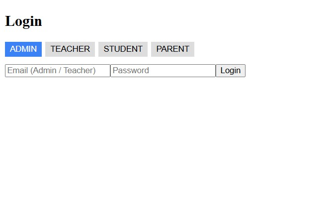
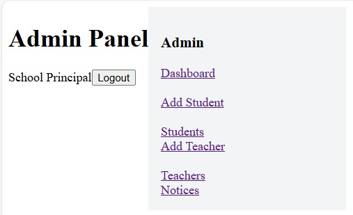
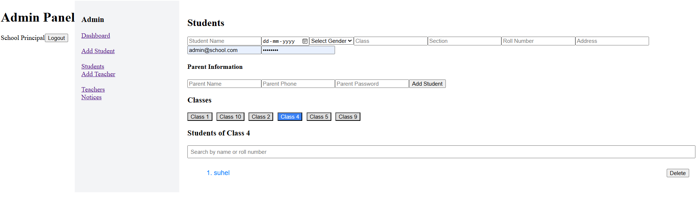
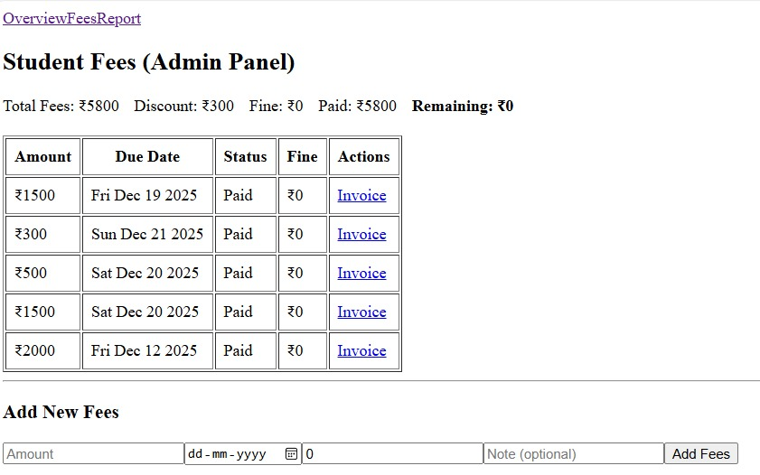

# Campus Fees Management System (MERN Stack)

A full-stack **Fee Management System** for colleges, built around student records and role-based access to fee data.

---

## 🚀 Features

### 🔐 Role-Based Access
- **Admin**: Manage students and all fee records
- **Teacher**: View fee records
- **Student**: View own fees status and invoices
- **Parent**: Monitor their child's fees

---

### 👨‍🎓 Student Management
- Add, update, and manage student records
- Class-wise and roll number-based organization
- Secure login credentials for students and parents

---

### 💰 Fee Management (ERP Logic)
- Fee assignment (not direct payment)
- Discounts / scholarships support
- Late fee fine calculation
- Paid vs pending fee tracking
- Remaining fee calculation
- Invoice PDF generation

> Fees follow **accounting-safe ERP flow**:
> Assign Fees → Receive Payment → Mark Paid

---

## 🛠️ Tech Stack

**Frontend**
- React.js
- React Router
- Axios

**Backend**
- Node.js
- Express.js
- REST APIs

**Database**
- MongoDB (Mongoose)

**Authentication & Security**
- JWT Authentication
- Role-Based Authorization

---

## 📸 Screenshots

### -Roll-Based-Access

**#Admin-Dashboard

 
### -Add-Student

### -Fees Management

